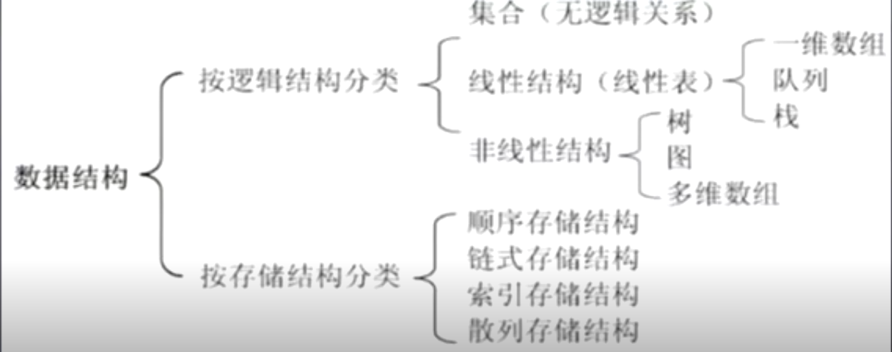
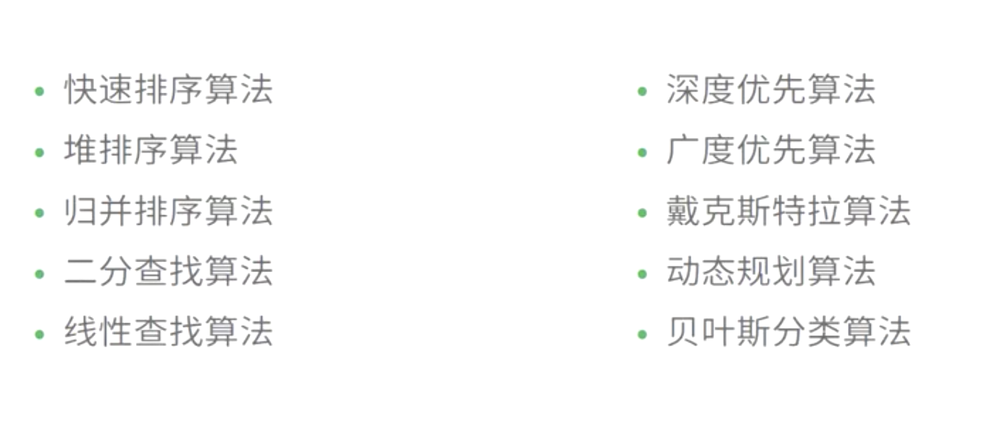

## js 数据类型

-   基本类型(栈 stack) : Number、String 、Boolean、Null 和 Undefined , Symbol(es6 新增)
-   基本数据类型是按值访问 高低分配,栈内存最大是 8MB, String:是特殊的栈内存 ,程序员分配
-   引用类型(堆 heap) :Object 、Array 、Function 、Data
-   引用类型数据在栈内存中保存的实际上是对象在堆内存中的引用地址(指针),向高分配,系统自动分配

##### 堆栈空间分配区别：

> -   栈（操作系统）：由操作系统自动分配释放 ，存放函数的参数值，局部变量的值等。其操作方式类似于数据结构中的栈；
> -   堆（操作系统）： 一般由程序员分配释放，若程序员不释放，程序结束时可能由 OS 回收，分配方式倒是类似于链表。

##### 二、堆栈缓存方式区别：

> -   栈使用的是一级缓存， 他们通常都是被调用时处于存储空间中，调用完毕立即释放；
> -   堆是存放在二级缓存中，生命周期由虚拟机的垃圾回收算法来决定（并不是一旦成为孤儿对象就能被回收）。所以调用这些对象的速度要相对来得低一些。

###### 堆 、栈数据结构区别：

> -   堆（数据结构）：堆可以被看成是一棵树，如：堆排序；
> -   栈（数据结构）：一种先进后出的数据结构。
> -   Symbol，表示独一无二的值, Symbol 最大的用途是用来定义对象的唯一属性名;

-   Symbol 值通过 Symbol 函数生成 let symbol1 = Symbol();
-   typeof 运算符用于 Symbol 类型值，返回 symbol;
-   Symbol 不是一个构造函数，如果用 new Symbol 会报错;
-   由于 Symbol 值不是对象，所以不能添加属性;
-   Symbol 值不能与其他类型的值进行运算;
-   Symbol 值可以显式转为字符串，也可以转为布尔值，但是不能转为数值;
-   在对象的内部，使用 Symbol 值定义属性时，Symbol 值必须放在方括号之中，如果不放在方括号中，该属性名就是字符串，而不是代表的 Symbol 值。
-   Symbol 值作为对象属性名时，不能用点运算符。由于点运算符后面总是字符串，所以不会读取 name 作为标识名所指代的那个值，导致属性名实际上是一个字符串，而不是一个 Symbol 值。

## 数据结构

> 数据结构的基本操作的设置的最重要的准则是,实现应用程序与存储结构的独立
> 数据结构:数据的存储+算法
> 

```javascript
数据结构:
    逻辑结构:反映数据之间的逻辑关系;
    存储结构:数据结构在计算机中的表示;
逻辑结构:
        集合:结构中的数据元素除了同属于一种类型外，别无其它关系。(无逻辑关系)
        线性结构 :数据元素之间一对一的关系(线性表)
        树形结构 :数据元素之间一对多的关系(非线性)
        图状结构或网状结构: 结构中的数据元素之间存在多对多的关系(非线性)
存储结构:
        顺序存储数据结构
        链式存储数据结构
        索引存储数据结构
        散列存储数据结构
线性结构 :
* 队列: 也是一种运算受限的线性表。它只允许在表的一端进行插入，而在另一端进行删除。允许删除的一端称为队头(front)，允许插入的一端称为队尾(rear)。先进先出。
* 栈: 是限制在表的一端进行插入和删除运算的线性表，通常称插入、删除的这一端为栈顶(Top)，另一端为栈底(Bottom)。先进后出。top= -1时为空栈，top=0只能说明栈中只有一个元素，并且元素进栈时top应该自增. 后进先出
* 串 :是零个或多个字符组成的有限序列。长度为零的串称为空串(Empty String)，它不包含任何字符。通常将仅由一个或多个空格组成的串称为空白串(Blank String) 注意：空串和空白串的不同，例如“ ”和“”分别表示长度为1的空白串和长度为0的空串。
* 树:一种非线性结构。树是递归结构，在树的定义中又用到了树的概念
    有序数:子节点之间有顺序关系
    无序树:子节点之间没有顺序关系
    二叉树:一种非线性结构。树是递归结构，在树的定义中又用到了树的概念


* 遍历二叉树：使得每一个结点均被访问一次，而且仅被访问一次。非递归的遍历实现要利用栈。二叉树的深度优先遍历的非递归的通用做法是采用栈，广度优先遍历的非递归的通用做法是采用队列

深度优先遍历：对每一个可能的分支路径深入到不能再深入为止，而且每个结点只能访问一次。要特别注意的是，二叉树的深度优先遍历比较特殊，可以细分为先序遍历、中序遍历、后序遍历
    先序遍历DLR：根节点->左子树->右子树(深度优先)
    中序遍历LDR：左子树->根节点->右子树。必须要有中序遍历才能得到一棵二叉树的正确顺序(深度优先)
    后续遍历LRD：左子树->右子树->根节点。需要栈的支持。(深度优先)
广度优先遍历：又叫层次遍历，从上往下对每一层依次访问，在每一层中，从左往右（也可以从右往左）访问结点，访问完一层就进入下一层，直到没有结点可以访问为止。
    层次遍历：用一维数组存储二叉树时,总是以层次遍历的顺序存储结点。层次遍历应该借助队列。(广度优先)

区别：
        深度优先搜素算法：不全部保留结点，占用空间少；有回溯操作(即有入栈、出栈操作)，运行速度慢。
        广度优先搜索算法：保留全部结点，占用空间大； 无回溯操作(即无入栈、出栈操作)，运行速度快。
        通常 深度优先搜索法不全部保留结点，扩展完的结点从数据库中弹出删去，这样，一般在数据库中存储的结点数就是深度值，因此它占用空间较少。所以，当搜索树的结点较多，用其它方法易产生内存溢出时，深度优先搜索不失为一种有效的求解方法。
        广度优先搜索算法，一般需存储产生的所有结点，占用的存储空间要比深度优先搜索大得多，因此，程序设计中，必须考虑溢出和节省内存空间的问题。
        广度优先搜索法一般无回溯操作，即入栈和出栈的操作，所以运行速度比深度优先搜索要快些

案例：
    深度优先：DOM Diff
    广度优先：V8 垃圾回收机制
```


内存: 一条很长一维数组;
地址 (门牌号) 指针(指向门牌号) 引用(带路党)

## 算法

#### 算法特征:

有穷性、确定性、可行性、输入、输出

#### 算法设计衡量：

正确性、可读性、健壮性, 时间复杂度, 空间复杂度

#### 算法分类



### 基本算法(必会)

#### 冒泡排序

> 

```javascript
function bubbleSort(arr) {
    var len = arr.length;
    for (var i = 0; i < len - 1; i++) {
        for (var j = 0; j < len - 1 - i; j++) {
            if (arr[j] > arr[j + 1]) {
                // 相邻元素两两对比
                var temp = arr[j + 1]; // 元素交换
                arr[j + 1] = arr[j];
                arr[j] = temp;
            }
        }
    }
    return arr;
}
```

#### 快速排序

> 

```javascript
//方案1
var arrs = [123, 45, 656, 233, 46, 80, 23, 122];
function quckilyu(arr) {
    var valete = arr[0];
    var leftarr = [];
    var rightarr = [];
    if (arr.length < 1) {
        return arr;
    }
    for (var i = 1; i < arr.length; i++) {
        if (arr[i] < valete) {
            leftarr.push(arr[i]);
        } else {
            rightarr.push(arr[i]);
        }
    }
    return quckilyu(leftarr).concat(valete, quckilyu(rightarr));
}
//方案2
function swap(items, firstIndex, secondIndex) {
    var temp = items[firstIndex];
    items[firstIndex] = items[secondIndex];
    items[secondIndex] = temp;
}

function partition(items, left, right) {
    var pivot = items[Math.floor((right + left) / 2)],
        i = left,
        j = right;
    while (i <= j) {
        while (items[i] < pivot) {
            i++;
        }
        while (items[j] > pivot) {
            j--;
        }
        if (i <= j) {
            swap(items, i, j);
            i++;
            j--;
        }
    }
    return i;
}

function quickSort(items, left, right) {
    var index;
    if (items.length > 1) {
        index = partition(items, left, right);
        if (left < index - 1) {
            quickSort(items, left, index - 1);
        }
        if (index < right) {
            quickSort(items, index, right);
        }
    }
    return items;
}

var items = [3, 8, 7, 2, 9, 4, 10];
var result = quickSort(items, 0, items.length - 1);
```

#### 插入排序

> 

```javascript
function insertionSort(arr) {
    var len = arr.length;
    var preIndex, current;
    for (var i = 1; i < len; i++) {
        preIndex = i - 1;
        current = arr[i];
        while (preIndex >= 0 && arr[preIndex] > current) {
            arr[preIndex + 1] = arr[preIndex];
            preIndex--;
        }
        arr[preIndex + 1] = current;
    }
    return arr;
}
```

#### 选择排序

> 

```javaScript
function selectionSort(arr) {
    var len = arr.length;
    var minIndex, temp;
    for (var i = 0; i < len - 1; i++) {
        minIndex = i;
        for (var j = i + 1; j < len; j++) {
            if (arr[j] < arr[minIndex]) {     // 寻找最小的数
                minIndex = j;                 // 将最小数的索引保存
            }
        }
        temp = arr[i];
        arr[i] = arr[minIndex];
        arr[minIndex] = temp;
    }
    return arr;
}
```
